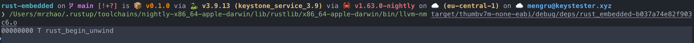

## Setup Environment

```shell
brew install --cask gcc-arm-embedded
brew install qemu
```
## Setup Project
```shell
rustup default nightly
rustup target add thumbv7m-none-eabi
cargo install cargo-binutils
```

## Setup MacOs

### Setup GCC

```shell
brew install --cask gcc-arm-embedded
```

==> Linking Binary 'arm-none-eabi-as' to '/usr/local/bin/arm-none-eabi-as'

==> Linking Binary 'arm-none-eabi-c++' to '/usr/local/bin/arm-none-eabi-c++'

==> Linking Binary 'arm-none-eabi-c++filt' to '/usr/local/bin/arm-none-eabi-c++filt'

==> Linking Binary 'arm-none-eabi-cpp' to '/usr/local/bin/arm-none-eabi-cpp'

==> Linking Binary 'arm-none-eabi-elfedit' to '/usr/local/bin/arm-none-eabi-elfedit'

==> Linking Binary 'arm-none-eabi-g++' to '/usr/local/bin/arm-none-eabi-g++'

==> Linking Binary 'arm-none-eabi-gcc' to '/usr/local/bin/arm-none-eabi-gcc'

==> Linking Binary 'arm-none-eabi-gcc-12.2.1' to '/usr/local/bin/arm-none-eabi-gcc-12

==> Linking Binary 'arm-none-eabi-gcc-ar' to '/usr/local/bin/arm-none-eabi-gcc-ar'

==> Linking Binary 'arm-none-eabi-gcc-nm' to '/usr/local/bin/arm-none-eabi-gcc-nm'

==> Linking Binary 'arm-none-eabi-gcc-ranlib' to '/usr/local/bin/arm-none-eabi-gcc-ra

==> Linking Binary 'arm-none-eabi-gcov' to '/usr/local/bin/arm-none-eabi-gcov'

==> Linking Binary 'arm-none-eabi-gcov-dump' to '/usr/local/bin/arm-none-eabi-gcov-du

==> Linking Binary 'arm-none-eabi-gcov-tool' to '/usr/local/bin/arm-none-eabi-gcov-to

==> Linking Binary 'arm-none-eabi-gdb' to '/usr/local/bin/arm-none-eabi-gdb'

==> Linking Binary 'arm-none-eabi-gdb-add-index' to '/usr/local/bin/arm-none-eabi-gdb

==> Linking Binary 'arm-none-eabi-gfortran' to '/usr/local/bin/arm-none-eabi-gfortran

==> Linking Binary 'arm-none-eabi-gprof' to '/usr/local/bin/arm-none-eabi-gprof'

==> Linking Binary 'arm-none-eabi-ld' to '/usr/local/bin/arm-none-eabi-ld'

==> Linking Binary 'arm-none-eabi-ld.bfd' to '/usr/local/bin/arm-none-eabi-ld.bfd'

==> Linking Binary 'arm-none-eabi-lto-dump' to '/usr/local/bin/arm-none-eabi-lto-dump

==> Linking Binary 'arm-none-eabi-nm' to '/usr/local/bin/arm-none-eabi-nm'

==> Linking Binary 'arm-none-eabi-objcopy' to '/usr/local/bin/arm-none-eabi-objcopy'

==> Linking Binary 'arm-none-eabi-objdump' to '/usr/local/bin/arm-none-eabi-objdump'

==> Linking Binary 'arm-none-eabi-ranlib' to '/usr/local/bin/arm-none-eabi-ranlib'

==> Linking Binary 'arm-none-eabi-readelf' to '/usr/local/bin/arm-none-eabi-readelf'

==> Linking Binary 'arm-none-eabi-size' to '/usr/local/bin/arm-none-eabi-size'

==> Linking Binary 'arm-none-eabi-strings' to '/usr/local/bin/arm-none-eabi-strings'

==> Linking Binary 'arm-none-eabi-strip' to '/usr/local/bin/arm-none-eabi-strip'

==> Linking Binary 'arm-none-eabi-ar' to '/usr/local/bin/arm-none-eabi-ar'

==> Linking Binary 'arm-none-eabi-addr2line' to '/usr/local/bin/arm-none-eabi-addr2li

### Setup qemu (virtual microcontroller)
```shell
brew install qumu
```

```shell
rustup component add llvm-tools-preview
# shows an empty binary
cargo size --target thumbv7m-none-eabi --bin rust-embedded
# before linking, the crate contains the panicking symbol
cargo rustc --target thumbv7m-none-eabi -- --emit=obj
```

```shell
# should use cargo nm, but does not work as expected
/Users/mrzhao/.rustup/toolchains/nightly-x86_64-apple-darwin/lib/rustlib/x86_64-apple-darwin/bin/llvm-nm target/thumbv7m-none-eabi/debug/deps/rust_embedded-b037a74e82f903c6.o
```



## Setup main interface

```shell
cargo objdump --bin app -- -d --no-show-raw-insn
```