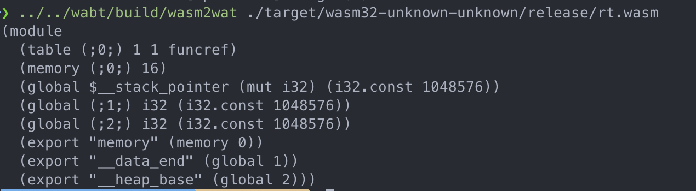
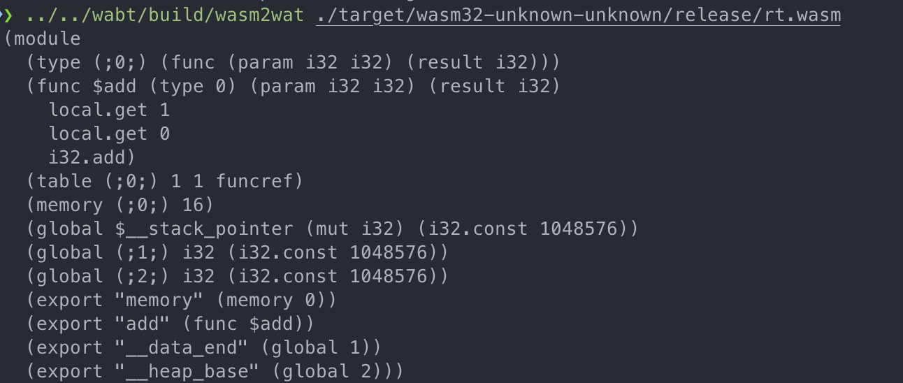
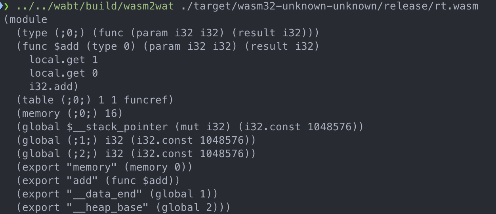

## Rust Runtime Example

### Set up project

```shell
# create an lib(in this example, we use library setup)
cargo init --lib
# create an executable
cargo build --target=wasm32-unknown-unknown --release
```


被编译成功的代码中没有add这个函数名，而是被编译成了stack pointer，需要使用#[no_mangle]


rustc 默认使用的是rust的ABI，编译成的目标代码的函数名可能会随着版本而变得不一致，所以推荐使用稳定的C ABI。


### Setup WebAssembly Binary Toolkit

- setup project https://github.com/WebAssembly/wabt
  提供了一些有用的工具：
- wasm2wat

### Setup

- setup project https://github.com/WebAssembly/binaryen

用于快速，高效地编译WebAssembly. 提供的wasm-dis，类似于wasm-opt. 但是wasm-dis生成的是WAST(WebAssembly S-Expression Text Format),
而wasm-opt生成的是标准的WAT(WebAssembly Text Format).

### Inspect target
```shell
cargo install twiggy
```
### Info

WebAssembly 通常被作为library，但是在[WASI](https://wasi.dev/) 的上下文中会作为executable。
