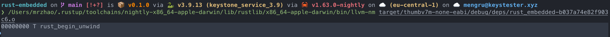

## Rust Runtime Example

### Set up project

```shell
# create an lib(in this example, we use library setup)
cargo init --lib
# create an executable
cargo build --target=wasm32-unknown-unknown --release
```

## Size
```shell
cargo size --target thumbv7m-none-eabi --bin rt
```


```shell
rustup component add llvm-tools-preview
# shows an empty binary
cargo size --target thumbv7m-none-eabi --bin rust-embedded
# before linking, the crate contains the panicking symbol
cargo rustc --target thumbv7m-none-eabi -- --emit=obj
```

```shell
# should use cargo nm, but does not work as expected
/Users/mrzhao/.rustup/toolchains/nightly-x86_64-apple-darwin/lib/rustlib/x86_64-apple-darwin/bin/llvm-nm target/thumbv7m-none-eabi/debug/deps/rt-261c79ebd53b251c.o
```


## Language Items
编译器通常会假设可执行的文件中有一些预设的symbol可以调用。比如
- "rust_eh_personality"(language item is eh_personality)，是在程序panic的使用被调用的。
- "rust_begin_panic"(language item is panic_impl)，控制程序在panic的时候屏幕上显示的内容。


## Control symbol names and section placement

- #[export_name = "foo"] sets the symbol name to foo。
- #[no_mangle] use the function or variable name。
- #[link_section = ".bar"] 将symbol放到.bar的section中。

## Link

```shell
cargo clean
cargo build
```
### Memory layout

```shell
cargo objdump --bin rt -- -d --no-show-raw-insn
```


### Vec table

```shell
cargo objdump --bin rt -- -s --section .vector_table
```


### start virtual microcontroller
```shell
qemu-system-arm -cpu cortex-m3 -machine lm3s6965evb -gdb tcp::3333 -S -nographic -kernel target/thumbv7m-none-eabi/debug/rt
```

### connect virtual microcontroller
```shell
arm-none-eabi-gdb -q target/thumbv7m-none-eabi/debug/rt
```
## Reference Doc
https://docs.rust-embedded.org/embedonomicon/memory-layout.html
